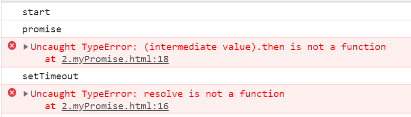
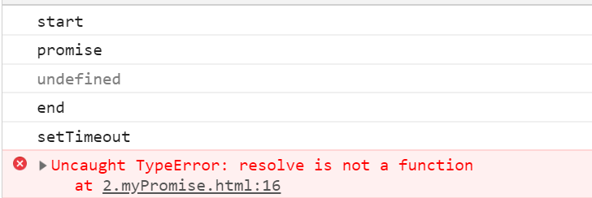

# 封装Promise

> 练习

* 热身

    * 先写个我们最常写的大家也清楚结果的Promise热身下
        ```js
        console.log("start");
        new Promise(resolve => {
            setTimeout(_ => {
                console.log("setTimeout")
            })
        })
        console.log("end");    
        ```

    * 总所周知，因为异步，所以打印的顺序是start，end，setTimeout    
    * 加大点难度
        ```js
        console.log("start");
        new Promise(resolve => {
            console.log("promise")
            setTimeout(_ => {
                console.log("setTimeout")
                resolve("how to make promise")
            })
        }).then(val => {
            console.log(val);
        })
        console.log("end");        
        ```
    * 首先promise是同步的，所以先打印的是start，promise，end
    * 之后再执行异步的setTimeout，随后才是then里面的how to make promise
    * 先了解这最简单的使用，以及异步打印的顺序
    * 接着我们在来看下这个代码，这个会打印1,2,3，注意这里不是链式调用
        ```js
        let p = new Promise(resolve => {
            setTimeout(_ => {
                resolve();
            })
        });
        p.then(_ => {
            console.log(1);
        })
        p.then(_ => {
            console.log(2);
        })
        p.then(_ => {
            console.log(3);
        })        
        ```
    * 此时我们在控制台输入，发现then直接调用了，并且打印了4
        ```js
        p.then(_ => {
            console.log(4);
        })   
        ```    

* 简单封装 
    * 我们先复制份html，然后把promise改成myPromise，引入我们的MyPromise.js
        ```html
        <!DOCTYPE html>
        <html lang="en">
        <head>
            <meta charset="UTF-8">
            <meta name="viewport" content="width=device-width, initial-scale=1.0">
            <title>Document</title>
        </head>
        <body>
            <script src="./MyPromise/MyPromise.js"></script>
            <script>
                console.log("start");
                new MyPromise(resolve => {
                    console.log("promise")
                    setTimeout(_ => {
                        console.log("setTimeout")
                        resolve("how to make promise")
                    })
                }).then(val => {
                    console.log(val);
                })
                console.log("end");
            </script>
        </body>
        </html>        
        ```  
    * 显然现在肯定是会报错的，因为我们js文件还是空的什么都没写，这是我们的准备工作
    * js中我们先定义个类，此时页面报错就变成了then方法
        ```js
        class MyPromise {
            
        }        
        ```   
    * 接着我们先来处理构造函数吧，大家都知道，我们promise里传的参数是个函数，而且该函数会被执行，所以先简单的写应该就是这样的
        ```js
        class MyPromise {
            constructor(handler){
                handler();
            }
        }
        ``` 
    * 此时页面的报错就会变成这样

           

    * 我们知道promise实例可以`.then`，所以我们在类中写个方法then再去处理then的逻辑
    * then至少需要传一个参数，我们先尝试下直接调用此方法，看下页面控制台的信息   
        ```js
        class MyPromise {
            constructor(handler){
                handler();
            }

            then(resolvedHandler){
                resolvedHandler();
            }
        }        
        ``` 
    * 此时在看页面报错的信息是这样的

           

    * 我们会发现打印undefined早于setTimeout，这个显然是有问题的，应该是定时器执行完以后再去执行then  
    * 且then中的resolvedHandler不应该直接调用，应该在前一个任务完成时，主动调用了resolve方法的时候再调用       
    * 所以我们要做以下2点
        * then中需要把传入当前的函数存储起来
        * 提供一个resolve方法 
    * 先提供个resolve方法，具体操作如下，此时页面就不会报错了，并且也能看到打印了**this is resolve**
        ```js
        class MyPromise {
            constructor(handler){
                handler(this._resolve.bind(this));
            }

            _resolve(){
                console.log("this is resolve")
            }

            then(resolvedHandler){
                resolvedHandler();
            }
        }        
        ``` 
    * promise为了更方便的处理完成任务之后的事情，所以还需要记录状态(pending, resolved, rejected) 
        ```js
        class MyPromise {
            constructor(handler){
                this.status = "PENDING";
                handler(this._resolve.bind(this));
            }

            _resolve(){
                // console.log("this is resolve")
                this.status = "RESOLVED";
            }

            then(resolvedHandler){
                resolvedHandler();
            }
        }        
        ```
    * 还记得我们热身的多个then调用(非链式的)，这里我们也要处理下，在构造函数中，用一个队列来维护，在then的时候添加进队列，最后在resolve方法中在执行
        ```js
        _resolve(){
            // console.log("this is resolve")
            this.status = "RESOLVED";

            let handler;
            while(handler = this.resolvedQueues.shift()){
                handler();
            }
        }        
        ```
    * 此时在加上状态的判断
        ```js
        class MyPromise {
            constructor(handler){
                this.status = "PENDING";
                this.resolvedQueues = [];
                handler(this._resolve.bind(this));
            }

            _resolve(){
                setTimeout(() => {
                    if(this.status !== "PENDING") return;
                    this.status = "RESOLVED";
            
                    let handler;
                    while(handler = this.resolvedQueues.shift()){
                        handler();
                    }
                }, 0)
            }

            then(resolvedHandler){
                switch(this.status){
                    case "PENDING":
                        this.resolvedQueues.push(resolvedHandler);
                        break;
                    case "RESOLVED":
                        resolvedHandler();
                        break;
                    case "REJECTED":
                        break;
                }
                return this;
                
            }
        }        
        ``` 
    * 接着就是处理微任务和宏任务的问题，先来看下这个代码，大家都知道，应该是promise，then，setTimeout的顺序执行，先执行微任务
        ```js
        setTimeout(_ => {
            console.log("setTimeout")
        })
        let p = new Promise(resolve => {
            resolve();
            console.log("promise")
        }).then(_ => {
            console.log("then")
        })        
        ```
    * 因为我们封装的MyPromise在resolve中使用的是setTimeout，导致宏任务平级， 所以才会打印promise，setTimeout，then
    * 如何解决这个问题，可以使用MutationObserver，这个属于微任务，可以参考mdn的案例，我们可以这么改写我们的myPromise
        ```js
        _resolve(){
            let config = { attributes: true};

            let observer = new MutationObserver(() => {
                if(this.status !== "PENDING") return;
                this.status = "RESOLVED";
        
                let handler;
                while(handler = this.resolvedQueues.shift()){
                    handler();
                }
            });
    
            observer.observe(document.body, config);

            document.body.setAttribute("gqf", "gqf");
        }
        ```
    * 这样我们打印的顺序就和原生的一样了    
                      
