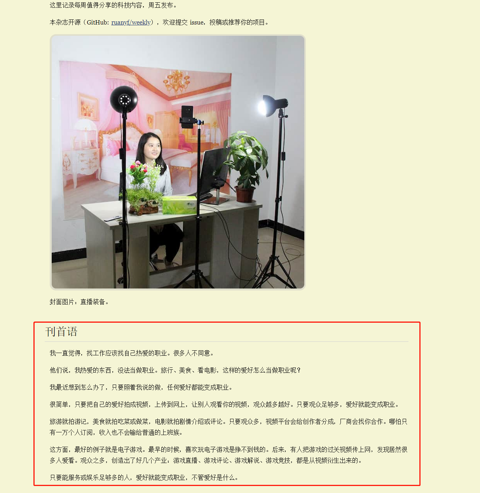

# Live-Demo

> 直播的背景

* 直播编程,打游戏，萌新间的知识交流，或是菜逼主播直播打游戏被打的嗷嗷叫的过程
* 先介绍个大佬的博客，该大佬叫[阮一峰](http://www.ruanyifeng.com/home.html)
* 其中有一期[科技爱好者周刊：第 76 期](http://www.ruanyifeng.com/blog/2019/10/weekly-issue-76.html),有这么一段话

    

* 我的爱好，认识我的人估计就认为喜欢打游戏，编程等
* 喜欢的游戏有这么几类，一般是基佬互相伤害的格斗类游戏，基佬一起闯关的或者自己单机通关的动作类游戏，
    还有就是现在依然未退坑的炉石稀有~
* 编程其实不完全是我的爱好，我喜欢的只是做做小游戏，写写小特效，和朋友们分享分享编程的小知识
* 本项目应该就会记录些我直播后录播的视频吧，会给出视频链接，有游戏，有编程，录播应该就会放在b站上，等审核通过上传成功后，
    会在菜单中更新
* 望游戏大佬，编程大佬轻喷，愿和一切萌新小伙伴一起成长
* [直播地址](https://live.bilibili.com/11287766)

> 菜单   

1. [hover_demo](https://qianfengg.github.io/Live-Demo/01-hover_demo/index), [录制视频](https://www.bilibili.com/video/av72032058)
2. [flex_game](https://flexboxfroggy.com/), [录制视频](https://www.bilibili.com/video/av70801303)
3. [star_scoring](https://qianfengg.github.io/Live-Demo/03-star_scoring/index), [录制视频](https://www.bilibili.com/video/av71020298) 
4. [Tower Hunter](./04-Tower%20Hunter游戏直播-10.13/Tower%20Hunter游戏.md), 录制视频暂无 
5. [magnifier](https://qianfengg.github.io/Live-Demo/05-magnifier/index), 录制视频暂无 
